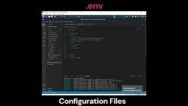
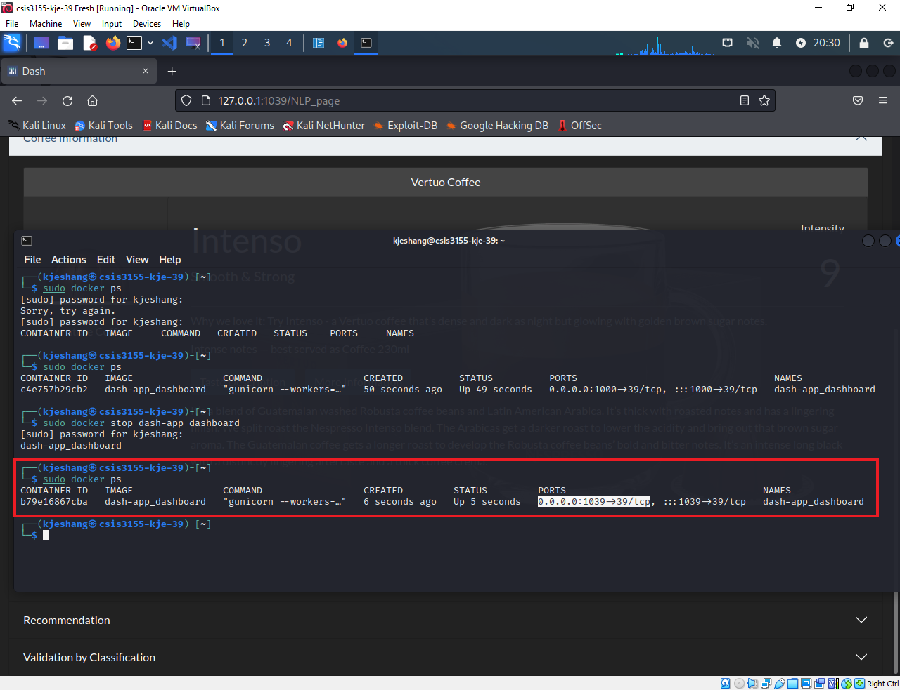
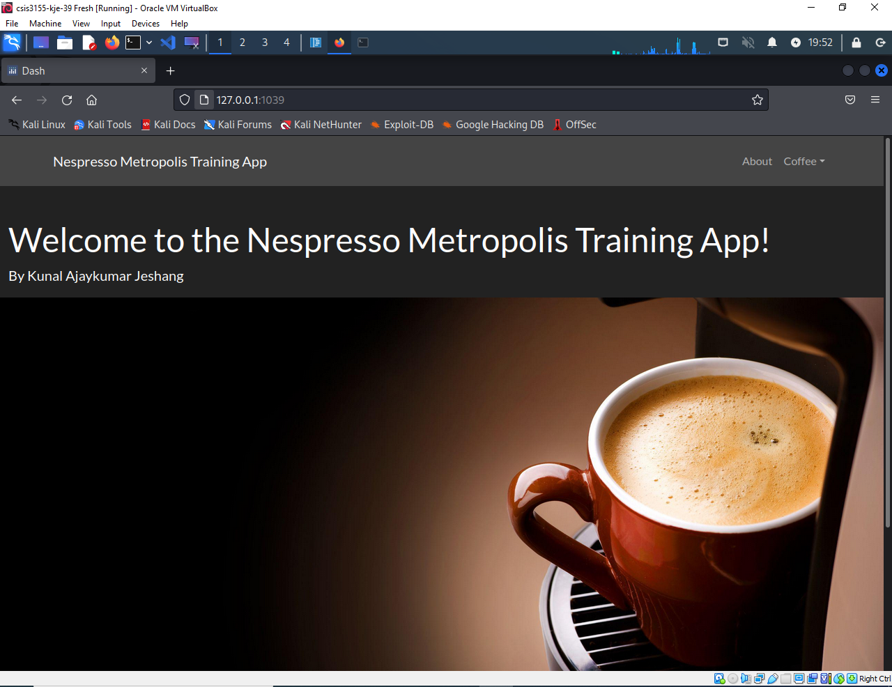
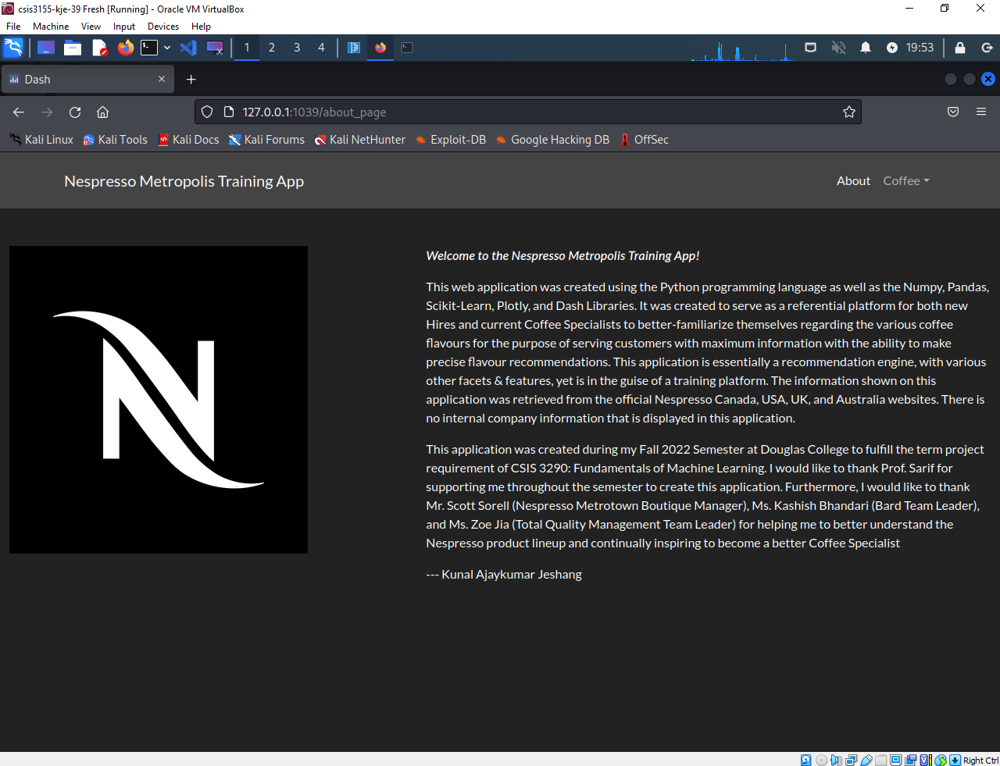
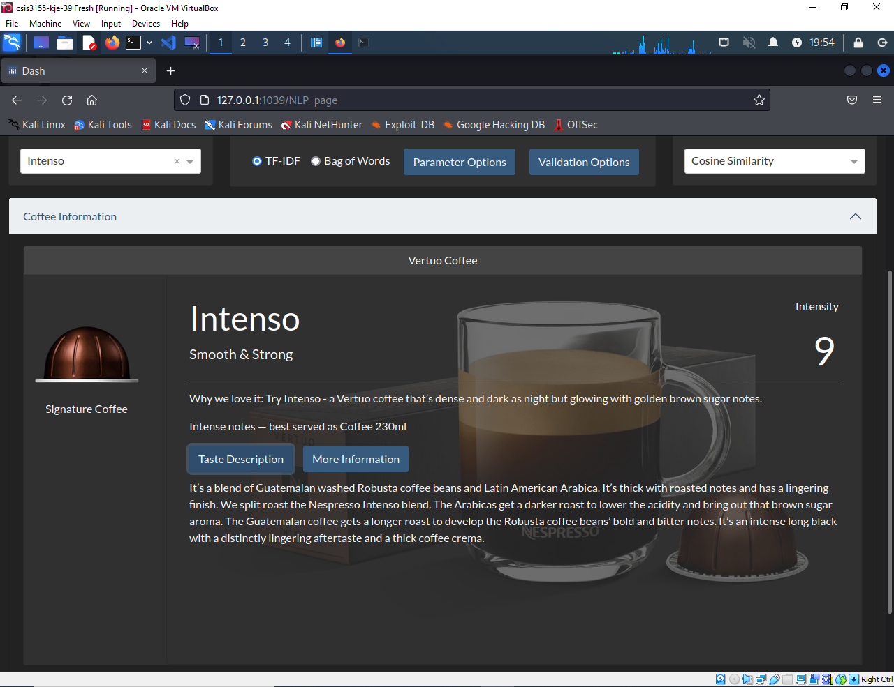
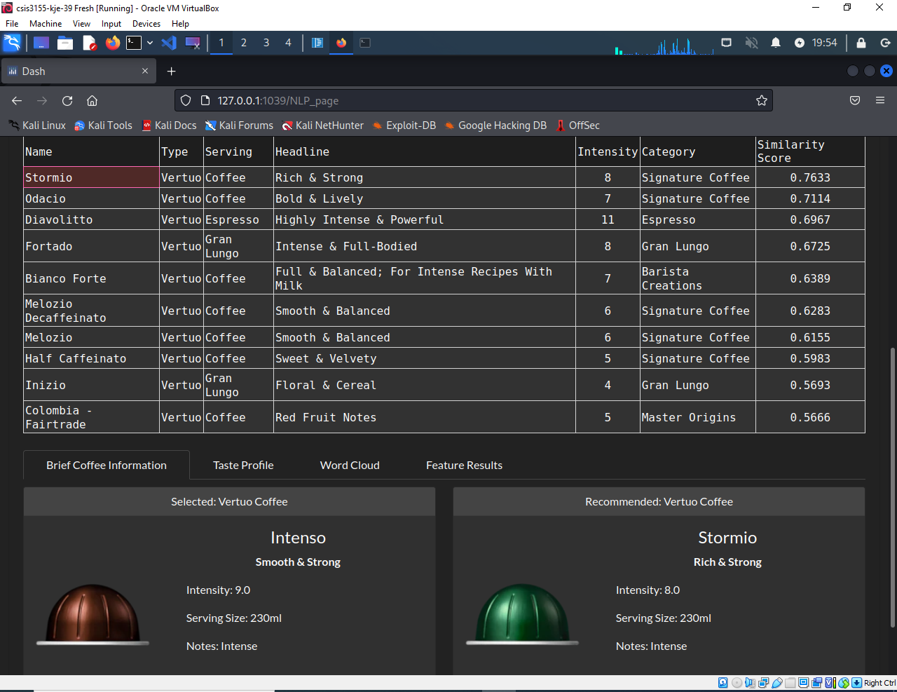
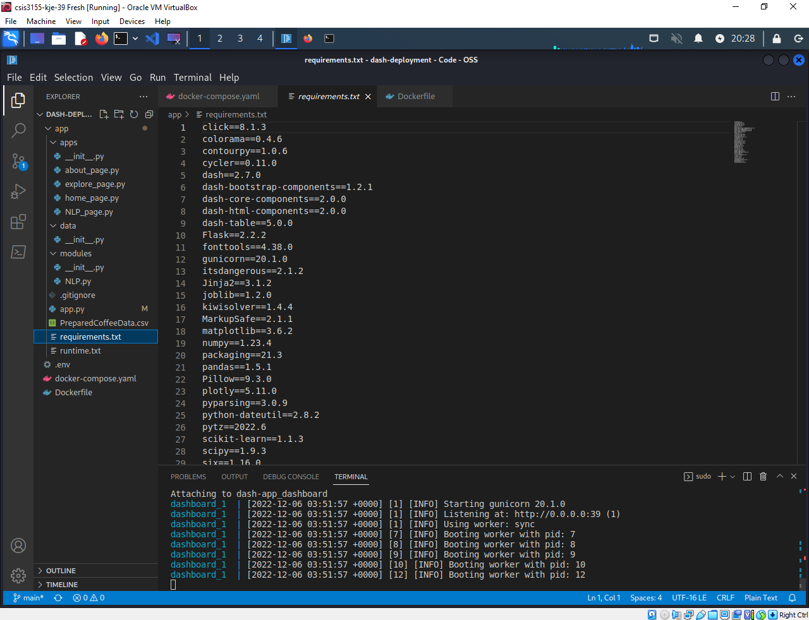
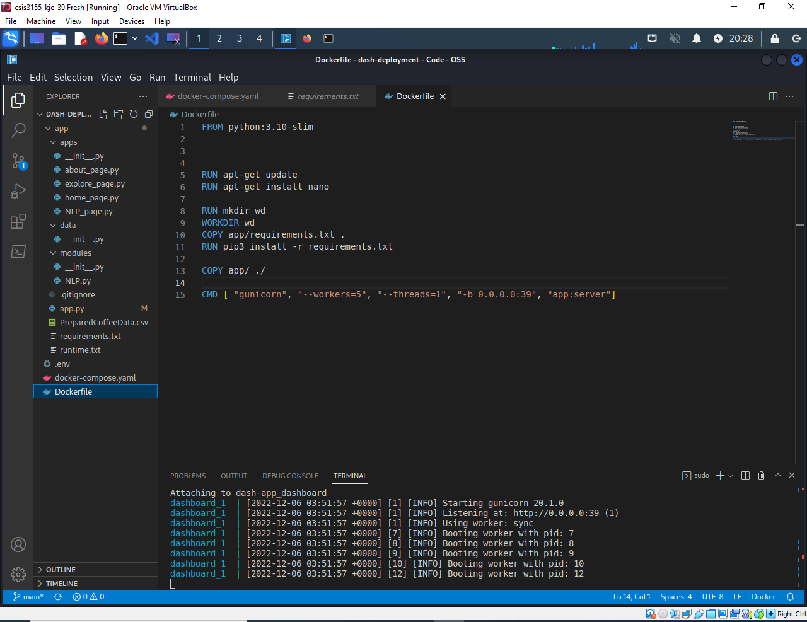
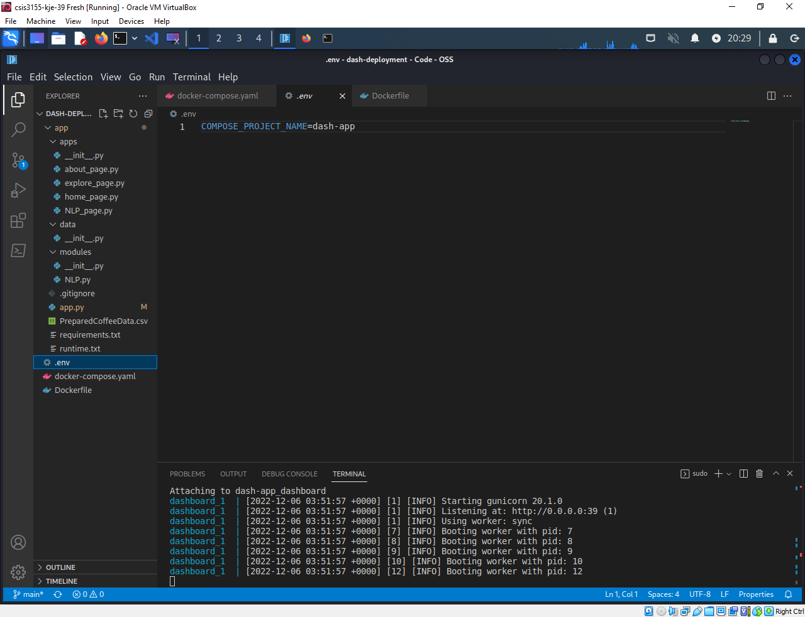
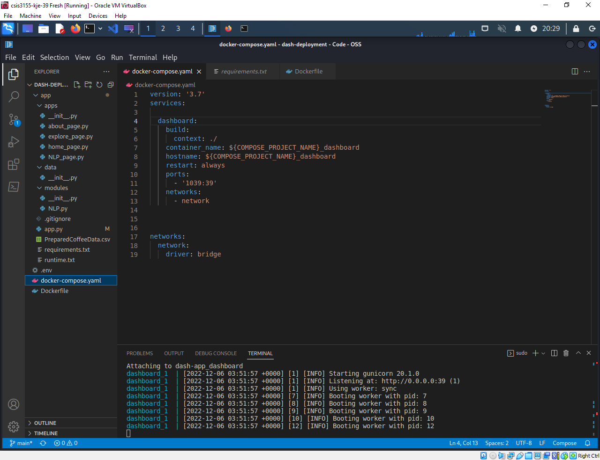

# **Docker Implementation of Nespresso Metropolis Training App**

This document was constructed to highlight how a project of this type could be deployed using Docker. This document was constructed to serve as a written portion of the Docker Lab for CSIS 3155: IT Security Fundamentals. The itent of the lab was to setup Docker on Kali Linux virtual machine, select any project/application (i.e., existing, self-created/custom-built), and create a YAML file to be used to deploy the coding project/application.

For reference, below is a table outlining the Kali Linux virtual machine specifications.

|Item|Description|Comments|
|--|--|--|
|Version|Kali 2023.3||
|CPUs|2||
|Memory/RAM|4 GB||
|Hard Disk|30 GB||
|Network Adapter|eth0|Custom NAT Network|

Below is an accompanying video that demonstrates the project running on a Kali Linux virtual machine using Docker. For more information, please refer to the _**Questions Addressed in the Video**_ section of this document.

# Useful Commands

Below are the list of steps I performed to deploy my project using Docker on Kali Linux. More explanation regarding the context of the project can be found on the forthcoming section of this document. That being said, the resources below were very helpful to me to perform this lab.
* The _Devcoons_ article [How to deploy your Plotly/Dash dashboard using Docker](https://www.devcoons.com/how-to-deploy-your-plotly-dash-dashboard-using-docker/) by AD T
* atheo89's [dash-deployment](https://github.com/atheo89/dashboard-deployment) _GitHub Repository_
* [How can I embed a YouTube video on GitHub wiki pages?](https://stackoverflow.com/questions/11804820/how-can-i-embed-a-youtube-video-on-github-wiki-pages) _StackOverflow_ page

1. Startup steps

        $ sudo apt install -y docker.io
        $ sudo apt install docker-compose
        $ sudo systemctl enable docker --now
        $ cd Desktop
        $ mkdir dash-deployment
        $ cd dash-deployment
        $ git clone https://github.com/kjeshang/nespresso-training-app.git

> Note that the github link shown in the above code snippet is no longer available.

2. The next set of steps can be done using Kali Linux GUI by opening the "dash-deployment" directory in VS Code or via the terminal. The commands below are required steps if they were performed using the terminal. Here we will rename the cloned project directory's name and make some changes to the **_app.py_** file as it instantiates the localhost web server of the project and starts up the project to run on the web browser.

        $ mv nespresso-training-app app
        $ cd app
        $ vi app.py
        :i
        **** MAKE THE CHANGES THAT REFLECT WHAT IS SHOWN BELOW ****
            # Instantiate Dash App ------------------------------------

            server = flask.Flask(__name__)
            # server.secret_key = os.environ.get('secret_key', str(randint(0, 1000000)))

            external_stylesheets = [dbc.themes.DARKLY];
            # app = dash.Dash(__name__,
            #                 meta_tags=[
            #                     {'name': 'viewport', 'content': 'width=device-width, initial-scale=1.0, maximum-scale=1.2, minimum-scale=0.5,'}],
            #                 external_stylesheets=external_stylesheets
            #             )
            app = dash.Dash(server=server, external_stylesheets=external_stylesheets)
            server = app.server
            app.config.suppress_callback_exceptions = True
        :wq
        $ cd ..

3. Create **_Dockerfile_** in the "dash-deployment" directory.

        $ vi Dockerfile
        :i
            FROM python:3.10-slim

            RUN apt-get update
            RUN apt-get install nano

            RUN mkdir wd
            WORKDIR wd
            COPY app/requirements.txt .
            RUN pip3 install -r requirements.txt

            COPY app/ ./

            CMD [ "gunicorn", "--workers=5", "--threads=1", "-b 0.0.0.0:39", "app:server"]
        :wq

4. Create **_.env_** file in the "dash-deployment" directory.

        $ vi .env
        :i
            COMPOSE_PROJECT_NAME=dash-app
        :wq

5. Create **_docker-compose.yaml_** file in the "dash-deployment" directory.

        $ vi docker-compose.yaml
        :i
            version: '3.7'
            services:

            dashboard:
                build: 
                context: ./
                container_name: ${COMPOSE_PROJECT_NAME}_dashboard
                hostname: ${COMPOSE_PROJECT_NAME}_dashboard
                restart: always
                ports:
                   - '1039:39'
                networks:
                   - network 
                

                
            networks:
                network:
                    driver: bridge
        :wq

6. Deploy the project using Docker. Make sure that the commands below are performed within the main "dash-deployment" directory.

        $ sudo docker-compose build
        $ sudo docker-compose up

7. Check to see if port is listening.

        $ sudo docker ps

8. Open Firefox web browser using Kali Linux GUI, and type **127.0.0.1:1039** in the URL bar to access the deployed project.

# Questions Addressed in the Video
> This section is written in more detail for clarity purposes due to less time to communicate in the video. Screenshots are also provided.

## Demonstrate your project running in docker

The project that I decided to select was my CSIS 3290: Fundamentals of Machine Learning Term Project. I worked on it this semester. It was developed using Python along with the Pandas, Numpy, Scikit-Learn, WordCloud, Plotly, and Dash libraries. The form the project takes is that of a web application that is able to perform machine learning and natural language processing technqiues on textual data. It is essentially a content-based recommendation engine in the guise of a training platform. As I work as a part-time Coffee Specialist at Nespresso Metrotown Boutique, I was inspired to create this project to serve as a proof-of-concept of a solution whereby one can more accurately recommend alternate flavours of coffees to customers. The target audience of this application is of both newly hired and current Coffee Specialists to strategically revise their coffee knowledge for the purpose of making accurate recommendations, in turn, perform well.

For information regarding the context of the project, please kindly refer to the [Development GitHub Repository](https://github.com/kjeshang/NespressoMetropolisTrainingApp). Note that another version of the project is used for deployment to Docker as codebase structure is streamlined and features causing overhead is removed; [GitHub Repository](https://github.com/kjeshang/nespresso-training-app). Although, for deployment to Docker I had still had to adjust the codebase to address the requirements of the lab assignment. The _Useful Commands_ section of this document will better explain the adjustments I made to the project codebase.

Below are some screenshots to serve as proof that the project is running on the required port (i.e., port 1039 as the last two digits of my student number is **_39_**), and that it is fully functional using Docker on Kali Linux.

|Screenshot|Detail|
|--|--|
||Port listening according to lab instructions (i.e., within red box).|
||Project running - Home page|
||Project running - About page|
||Project running - NLP (selected coffee information)|
||Project running - NLP (selected coffee recommendation)|

## Your configuration file

Below are screenshots of the configuration file and related files that required either creation or manipulation in order to deploy the project using Docker.

|Screenshot|Detail|
|--|--|
||"Requirements.txt" file of Python virtual environment containing all Python package dependencies of the project.|
||The "app.py" within the main project directory is script that runs project on server. The changes made to the script are indicated (i.e., within red box).|
||Dockerfile|
||The ".env" file.|
||The "docker-compose.yaml" file.|

## What was easy and what was difficult about this lab?

I managed to perform this lab in a reasonable amount of time due to the fact that I selected a project I personally worked that utilizes a technology stack I am both comfortable with and use on a frequent basis. Thus, I knew what to search for to attempt to fulfill the docker deployment requirement of this lab. The challenging part can also be related to performing research as most resources I found were providing instructions in the context of deploying to Azure or Heroku with incorporation of Docker. In the case of the lab, the expected requirement was more streamlined. The other challenging part was understanding how to construct the "yaml" file to fulfill docker deployment of my specific project. If I was attempting to deploy a different project that utilized a different technology stack, the contents of the "yaml" file would change. The other hard part was that I had to actually change some of the code in the "app.py" file, which dealt with instantiation of the dash application and server, to accomodate for docker.Thus, I would have to upskill myself to know the needs of my project in the context of docker which is the true challenge.

## What should be done for a production deployment versus a development deployment.

Production Deployment:
* In a production environment the deployed service may fail. If it fails, then the end users would not be able to utilize the service, in turn, halting their productivity or them being unable to fulfill their requirement. Thus, utilizing the "restart:always" and "update_config:true" configurations is needed to attempt to help maintain the deployed service automatically (_6 docker compose best practices for Dev and prod_).
* In a production environment, "Docker Compose reuses port bindings, so an old service is still available, even though its container was destroyed." Having an awareness and checking which container images are still in use. Utilizing the `--remove-orphans` command is helpful here as it makes sure that Docker Compose removes containers and images that are not in use regardless on whether a container is using them as it is imperative to get services to restart successfully.
* Specifying the CPU and memory of the container in the _yaml_ file as when deployed to a Platform-as-a-Service (PaaS, such as Azure, Google Cloud, and Heroku, the project must be within the bounds of the PaaS to avoid service shutdown, resource wastage, and excess production costs (_6 docker compose best practices for Dev and prod_).

Development Deployment:
* There are certain files that may be necessary for development but not for production. In turn, an override file _yaml_ file may be required to avoid redundancy when shifting a project from development to production, and at the same time, maintaining separate configuration of settings for both development and deployment (_6 docker compose best practices for Dev and prod_).
* YAML anchors can be used to share default settings between services and projects. This can speed up development when working on multiple projects in real-world situation. Overriding alias property is possible when most configurations are shared between services/projects with same Dockerfile, but slight variation is required in _yaml_ file (_6 docker compose best practices for Dev and prod_).
* The `docker-compose` command which is utilized in development to build/orchestrate the container of the service/project but may be overlooked in favour of kubernetes or swarm (_R/Docker - Docker for "development" vs. "production"_).

## What are the top 3-5 security considerations when deploying docker. Explain.

* Both the host machine and Docker should be up-to-date to stop security issues. This is common knowledge as updated an operating system and containerization software contains security upgrades (_Docker security - best practices to secure a Docker container_).
* It is better to run containers as a non-root user to mitigtate security vulnerabilities. Envrionment safety is ensured when running containers on root-less mode. This helps in the event a threat actor accesses the host container using malicious content. If this happens, then anyone who has pulled the container from Docker can access the server of whatever is deployed in the container (_Docker security - best practices to secure a Docker container_).
* Setting resource quotas and limits are important as it reduces the chance of excess resource consumption and increases efficiency of the overall docker environment. In turn, security improves as the container would run at an expected speed. Likelihood of attacks are minimized because if "one container got infected with malicious code, it won’t let in many resources in as the quota cut it off" (_Docker security - best practices to secure a Docker container_).

# References

6 docker compose best practices for Dev and prod. ReleaseHub. (n.d.). Retrieved December 6, 2022, from https://releasehub.com/blog/6-docker-compose-best-practices-for-dev-and-prod 

atheo89. (n.d.). Dashboard-deployment/dash-deployment at Main · Atheo89/dashboard-deployment. GitHub. Retrieved December 6, 2022, from https://github.com/atheo89/dashboard-deployment/tree/main/dash-deployment 

CompTIA Security+ Guide to Network Security Fundamentals 7e Paperback Publisher: Cengage, ISBN-10 : 0357424379, Author: Mark Ciampa

Docker Development Best Practices. Docker Documentation. (2022, December 6). Retrieved December 6, 2022, from https://docs.docker.com/develop/dev-best-practices/ 

Docker security - best practices to secure a Docker container. Section. (n.d.). Retrieved December 6, 2022, from https://www.section.io/engineering-education/best-practices-to-secure-a-docker-container/ 

Docker stop. Docker Documentation. (2022, December 6). Retrieved December 6, 2022, from https://docs.docker.com/engine/reference/commandline/stop/ 
Free online screen recorder. Free Online Screen Recorder | Online Video Recorder. (n.d.). Retrieved December 6, 2022, from https://www.screencapture.com/ 

Krueger, E. (2021, October 11). Dockerize your dash app. Medium. Retrieved December 6, 2022, from https://towardsdatascience.com/dockerize-your-dash-app-1e155dd1cea3 

Opdam, R. (2022, April 25). Deploy containerized plotly dash app to Heroku with CI/CD. Medium. Retrieved December 6, 2022, from https://towardsdatascience.com/deploy-containerized-plotly-dash-app-to-heroku-with-ci-cd-f82ca833375c 

R/Docker - Docker for "development" vs. "production". reddit. (n.d.). Retrieved December 6, 2022, from https://www.reddit.com/r/docker/comments/j8ez6m/docker_for_development_vs_production/ 

T, A., &amp; T, A. (2021, February 6). How to deploy your plotly/dash dashboard using Docker. Devcoons. Retrieved December 6, 2022, from https://www.devcoons.com/how-to-deploy-your-plotly-dash-dashboard-using-docker/ 

Try docker compose. Docker Documentation. (2022, December 6). Retrieved December 6, 2022, from https://docs.docker.com/compose/gettingstarted/

